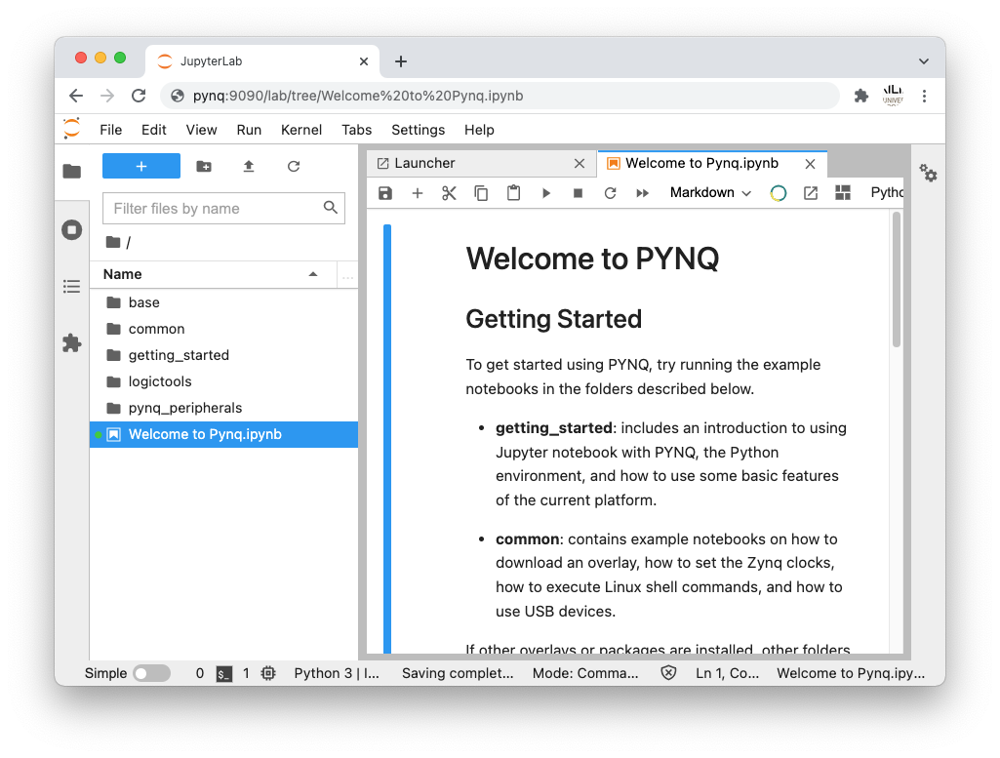
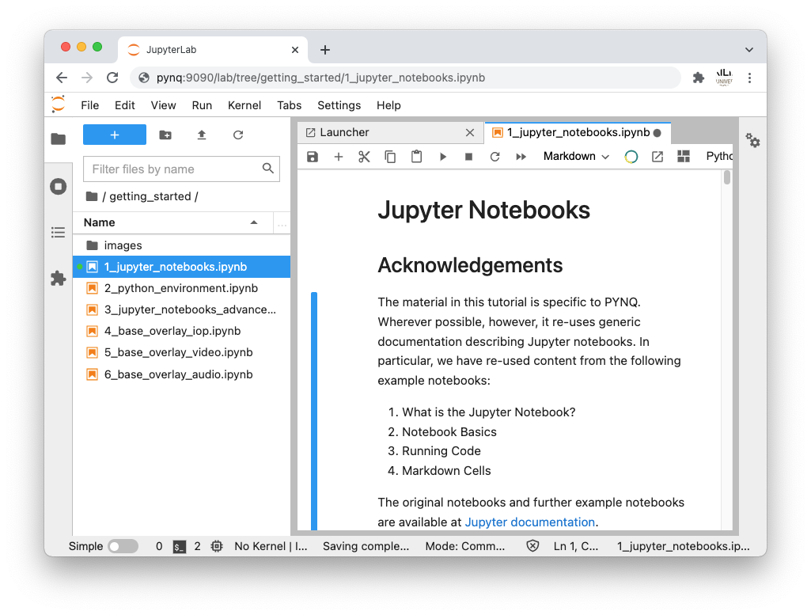

.. _connecting-to-jupyter-notebook:

******************************
Connecting to Jupyter Notebook
******************************

Once your board is setup and you have the IP address, connect to 
Jupyter by opening a web browser on your computer and navigate to:

  * http://<IP address of your board>/lab or http://pynq

.. NOTE:: 
    The original Jupyter Notebook is install as part of PYNQ along with the more 
    Recent Jupyter lab. You can access Jupyter Lab by adding
    /lab to the URL you use to access the board. This is useful to know if you 
    accidentally forget to add /lab to the path and you see the Jupyter Notebook 
    environment. You can use Jupyter notebook if you prefer, but we recommend 
    Jupyter Lab for use with PYNQ as it supports additional features and 
    functionality. 
      
If your board is configured correctly you will be presented with the 
Jupyter login screen. The username is **xilinx** and the password is also **xilinx**.

After logging in, you will see the following screen:

The first time you connect, it may take a few seconds for your computer to
resolve the hostname/IP address.

Example Notebooks
=================

PYNQ uses the Jupyter Notebook environment to provide examples and documentation.
Using your browser you can view and run the notebook documentation interactively.

The getting_started folder in the Jupyter home area includes some introductory
Jupyter notebooks. 
 

The example notebooks have been divided into categories

  * common: examples that are not overlay specific

Depending on your board, and the PYNQ image you are using, other folders may be
available with examples related to Overlays. E.g. The *base* directory will 
have examples related to the base overlay. If you install any additional 
overlays, a folder with example notebooks will usually be copied here.

When you open a notebook and make any changes, or execute cells, the notebook
document will be modified. It is recommended that you "Save a copy" when you
open a new notebook. If you want to restore the original versions, you can
download all the example notebooks from `GitHub
<https://www.github.com/xilinx/pynq>`_.

Troubleshooting
===============

If you are having problems, please see the Troubleshooting section in
:ref:`faqs` or go the `PYNQ support forum <https://discuss.pynq.io>`_
